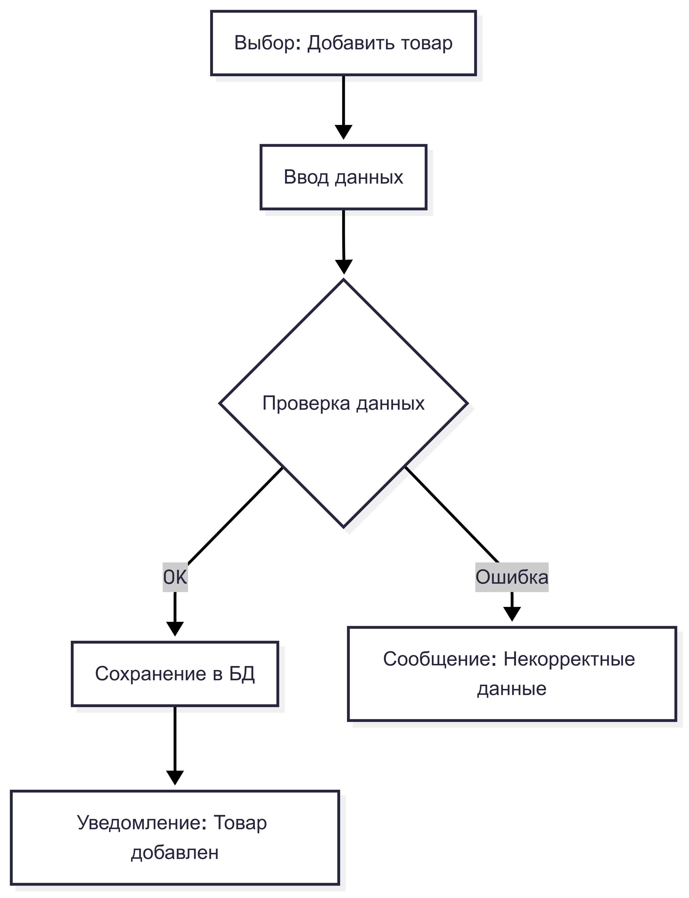
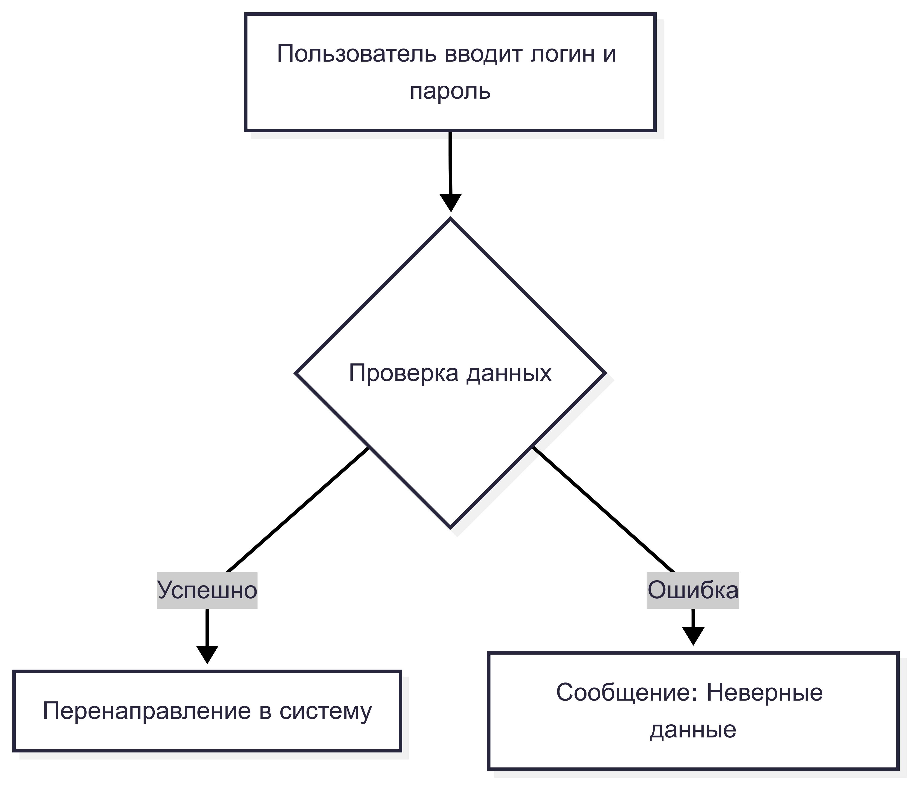
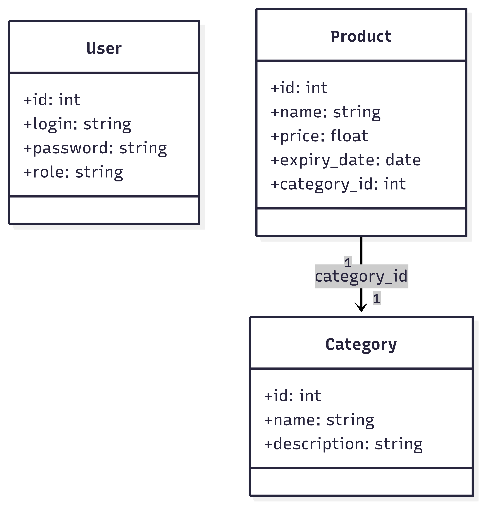
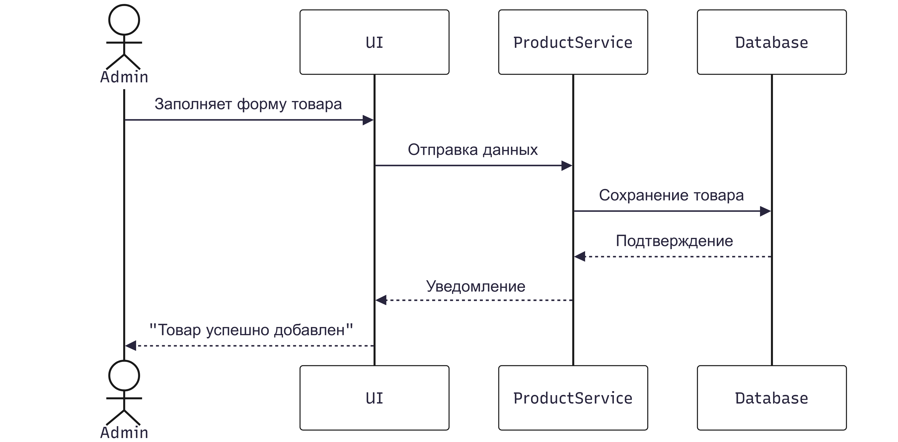
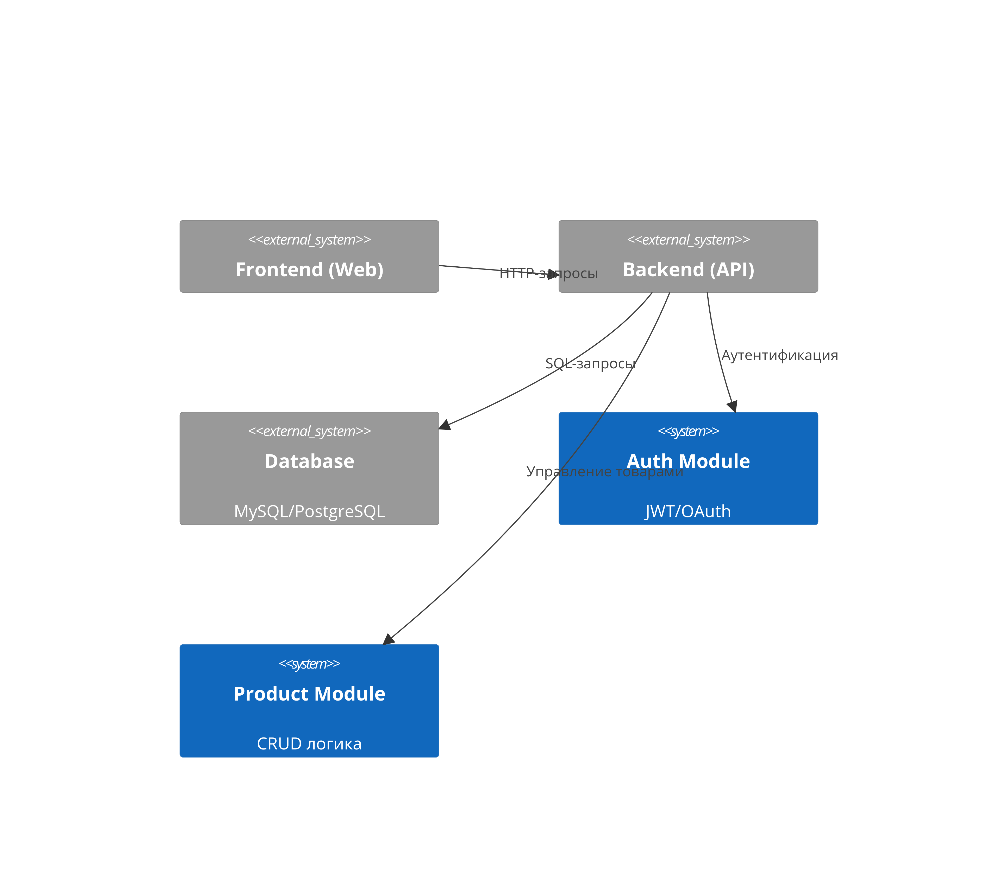

# Лабораторная работа 4
## Индивидуальный проект
*Вариант:* Товар

#### 1. Use Case Diagram
  
**Сценарий:** Добавление товара...

#### 2. Activity Diagrams
- Аутентификация:  
   

#### 3. Class Diagram
  

#### 4. Sequence Diagram
  

#### 5. Component Diagram
  
