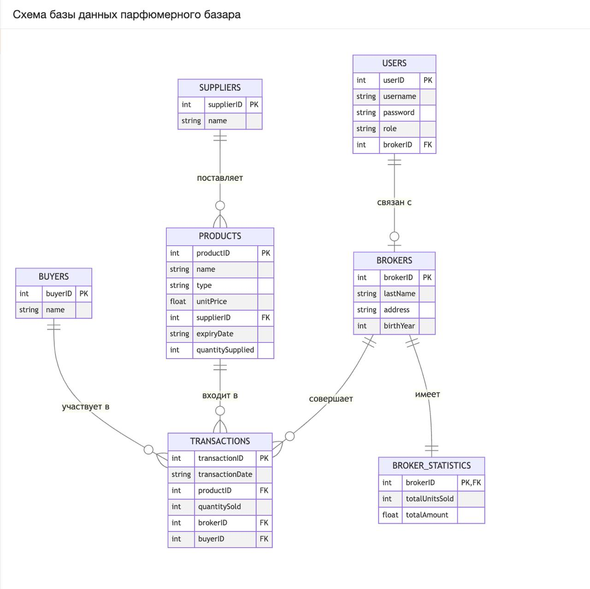

## Схема базы данных


## Код для создания таблиц
```sql
-- Создание таблицы маклеров
CREATE TABLE Brokers (
    BrokerID INTEGER PRIMARY KEY AUTOINCREMENT,
    LastName TEXT NOT NULL,
    Address TEXT,
    BirthYear INTEGER CHECK (BirthYear > 1900 AND BirthYear < 2023)
);

-- Создание таблицы поставщиков
CREATE TABLE Suppliers (
    SupplierID INTEGER PRIMARY KEY AUTOINCREMENT,
    Name TEXT NOT NULL
);

-- Создание таблицы покупателей
CREATE TABLE Buyers (
    BuyerID INTEGER PRIMARY KEY AUTOINCREMENT,
    Name TEXT NOT NULL
);

-- Создание таблицы товаров
CREATE TABLE Products (
    ProductID INTEGER PRIMARY KEY AUTOINCREMENT,
    Name TEXT NOT NULL,
    Type TEXT NOT NULL,
    UnitPrice REAL NOT NULL CHECK (UnitPrice > 0),
    SupplierID INTEGER,
    ExpiryDate TEXT,
    QuantitySupplied INTEGER NOT NULL CHECK (QuantitySupplied >= 0),
    FOREIGN KEY (SupplierID) REFERENCES Suppliers(SupplierID)
);

-- Создание таблицы сделок
CREATE TABLE Transactions (
    TransactionID INTEGER PRIMARY KEY AUTOINCREMENT,
    TransactionDate TEXT NOT NULL,
    ProductID INTEGER,
    QuantitySold INTEGER NOT NULL CHECK (QuantitySold > 0),
    BrokerID INTEGER,
    BuyerID INTEGER,
    FOREIGN KEY (ProductID) REFERENCES Products(ProductID),
    FOREIGN KEY (BrokerID) REFERENCES Brokers(BrokerID),
    FOREIGN KEY (BuyerID) REFERENCES Buyers(BuyerID)
);

-- Создание таблицы статистики маклеров
CREATE TABLE BrokerStatistics (
    BrokerID INTEGER PRIMARY KEY,
    TotalUnitsSold INTEGER DEFAULT 0,
    TotalAmount REAL DEFAULT 0,
    FOREIGN KEY (BrokerID) REFERENCES Brokers(BrokerID)
);

-- Создание таблицы пользователей для аутентификации
CREATE TABLE Users (
    UserID INTEGER PRIMARY KEY AUTOINCREMENT,
    Username TEXT UNIQUE NOT NULL,
    Password TEXT NOT NULL,
    Role TEXT NOT NULL CHECK (Role IN ('Broker', 'Management')),
    BrokerID INTEGER,
    FOREIGN KEY (BrokerID) REFERENCES Brokers(BrokerID)
);
```
